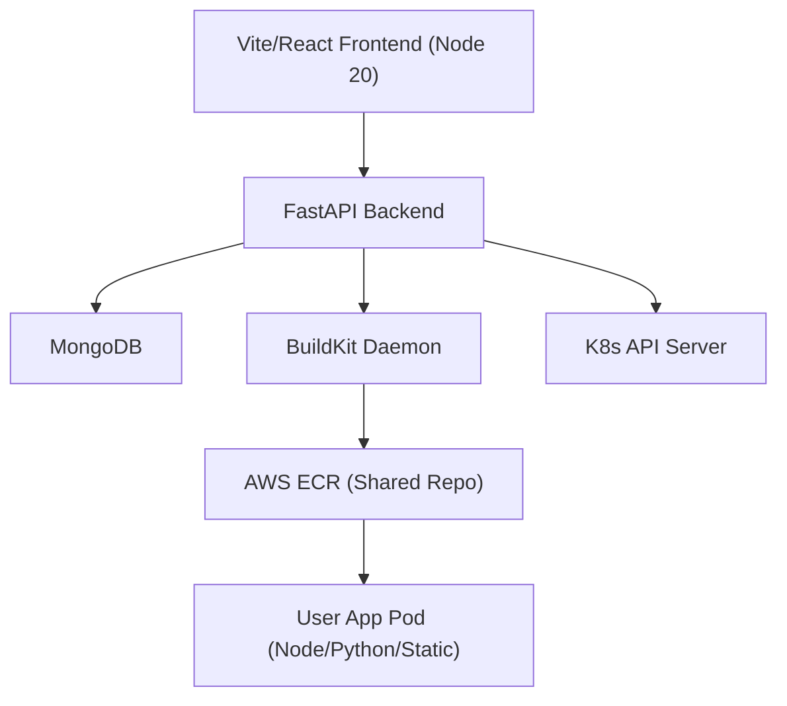

# DeployHub AI Agent Workspace Context (`AGENTS.md`)

Welcome to DeployHub! This file is a high-fidelity workspace roadmap designed to maximize token efficiency and prevent redundant codebase scans for AI coding assistants.

---

## 1. Core Architecture



- **Frontend**: React + Vite (Port `3080`).
- **Backend**: FastAPI (Port `3081`). Exposes `/metrics` for Prometheus and WebSocket/SSE endpoints for real-time tracking.
- **User Apps**: Deployed into the `deployhub-apps` namespace, exposed via Traefik NodePorts on the k3s cluster.

---

## 2. GitOps & Secrets Strategy (ArgoCD)

- **Application Controller**: ArgoCD runs in the `argocd` namespace and manages all non-sensitive manifests under `k8s_deploy/overlays/k3s/` (`argocd-application.yaml`).
- **Secrets Protection**: All credential templates in `k8s_deploy/base/secrets.yaml` are excluded from the base `kustomization.yaml` resource list. Instead, they are bootstrapped/updated directly in CI.
- **Pruning Exemption**: Secrets are annotated with:
  ```yaml
  metadata:
    annotations:
      argocd.argoproj.io/sync-options: Prune=false
  ```
  This prevents ArgoCD's automated sync cycle from pruning them from the namespace.
- **Static Ingress**: `cloudflared.yaml` uses native Kubernetes env variable expansion (`$(TUNNEL_ID)`) rather than raw file replacements, making it fully GitOps-native.

---

## 3. Observability Stack

- **Prometheus** (Port `3090`): Configured to scrape both control-plane (`deployhub`) and user app pods (`deployhub-apps` via annotations).
- **Loki & Promtail**: Scrapes and aggregates logs across all namespaces.
- **metrics-server**: Installed in the k3s overlay to enable CPU/memory metrics via `metrics.k8s.io`.
- **Grafana** (Port `3091`):
  - **No PVC Conflict**: Dashboard provisioning ConfigMaps are mounted directly as directories under `/etc/grafana/dashboards/` rather than `/var/lib/grafana/...` to bypass subPath PVC mount bugs.
  - **Dashboards**: Features "DeployHub Overview" (Default Home) and "App Overview" (filtered dynamically via `$app` variable linking logs and restarts).
  - **Anonymous Access**: Anonymous Viewer mode enabled.

---

## 4. Key Developer Commands

### Local Validation
```bash
# Verify Kustomize build compiles cleanly
kubectl kustomize k8s_deploy/overlays/k3s
```

### GitOps Image Update (CI Pipeline)
```bash
cd k8s_deploy/overlays/k3s
kustomize edit set image deployhub-backend=$ECR_REGISTRY/$BACKEND_IMAGE:$IMAGE_TAG
kustomize edit set image deployhub-frontend=$ECR_REGISTRY/$FRONTEND_IMAGE:$IMAGE_TAG
git add kustomization.yaml
git commit -m "chore(deploy): update image tags to $IMAGE_TAG [skip ci]"
git push origin main
```

---

## 5. Recent Core Milestones

| Commit Hash | Milestone Summary |
|---|---|
| `79a34c0` | **ArgoCD Install Fix**: Used `--server-side` apply for `install.yaml` in pipeline to bypass K8s 256KB annotation limits on massive CRDs. |
| `0f0b8d3` | **GitOps Transition**: Migrated k3s deploy pipeline to pull-based ArgoCD syncing, refactored Cloudflare tunnel configs, and secured bootstrapped secrets. |
| `1879bbd` | **Grafana PVC Fix**: Relocated provisioning mounts to `/etc/grafana/dashboards/` to avoid `subPath` volume lockups. |
| `e9dee6c` | **Observability Feature**: Added metrics-server, anonymous Grafana viewer access, Loki logging dropdown variables, and enhanced MonitoringPage UI. |
| `f7c4718` | **Node start fix**: Served built production distributions via `npx serve -s` rather than running dev servers in containerized user apps. |
| `0ef756b` | **CI Race Condition Fix**: Added a sleep delay in the deploy script to allow ArgoCD to fetch manifests and update deployments, preventing immediate `kubectl rollout status` failure due to stale `ProgressDeadlineExceeded` state. |
| `ad8afd2` | **KodeKloud Constraint Fix**: Enforced `standard` CPU credits (`cpu_credits = "standard"`) on all Terraform AWS instances/launch templates to prevent session suspension from `unlimited` t3 default mode. |
| `554c7bd` | **Resource Starvation Fix**: Decreased backend pod CPU/memory requests to `50m` / `128Mi` to resolve rolling update deadlocks on constrained `t3.medium` instances during ArgoCD syncs. |
| `a13c156` | **Pipeline DB Verification Fix**: Switched MongoDB initialization check in CI to query `statefulset/mongodb` instead of `deployment/mongodb` and updated the referenced PVC name. |
| `6c95789` | **Free Tier Upgrade**: Upgraded EC2 instance types to `m7i-flex.large` (8GB RAM) and removed T-series CPU credit specifications. |
| `27e6274` | **MongoDB Connection Fix**: Fixed hardcoded `MONGO_URI` in CI to point to the renamed `mongodb` headless service and added debug logs. |
| `ee2b0e0` | **GitOps Permission Fix**: Added `permissions: contents: write` to the CI workflow to allow `kustomize` image tag updates to successfully push back to Git, and set `eks` as the default deployment environment. |
| `db1a17e` | **Terraform Syntax Fix**: Corrected an HCL parser error in the `ecs-monitoring` module by expanding single-line `dns_records` into multi-line blocks. |
| `3255098` | **EKS AMI & Duplicate ECR Fix**: Set `ami_type = "AL2023_x86_64_STANDARD"` to support 7th generation EC2 nodes on EKS 1.29, and removed duplicate ECR module creation from the `prod` state to prevent `RepositoryAlreadyExists` collisions. |
| `0e0d5d7` | **EKS EBS CSI Driver**: Installed `aws-ebs-csi-driver` EKS Add-on via Terraform (with IRSA) because EKS 1.23+ removed the in-tree provisioner, which previously starved MongoDB PVCs in a `Pending` state. |
| `a5b7c89` | **EKS NodePort Limits**: Shifted Frontend/Backend NodePorts from 3080/3081 to 30080/30081 to comply with strict EKS `30000-32767` limits. |
| `85bafc7` | **ALB Controller TargetGroupBinding**: Replaced standard Kubernetes `Ingress` with AWS `TargetGroupBinding` CRDs to allow Terraform to manage ALB listener routing rules without the AWS Load Balancer Controller fighting it and overwriting the listeners. |
| `bf84e62` | **ALB Controller IMDSv2 Crash Fix**: Dynamically injected `vpcId` and `region` directly into the AWS Load Balancer Controller Helm chart to bypass strict AL2023 IMDSv2 hop limit=1 constraints, which previously caused infinite CrashLoopBackOffs on EKS EC2 nodes. |
| `3c68267` | **ALB Ghost Ingress Cleanup**: Implemented an aggressive `kubectl delete ingress` pre-apply step in CI to purge orphaned Ingress objects that were previously removed from Kustomize but left lingering in the cluster, preventing them from hijacking the ALB. |
