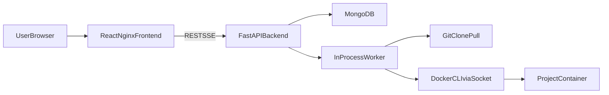

# DeployHub

DeployHub is a real self-service deployment platform for public GitHub repositories. It performs real `git clone`, real `docker build`, real `docker run`, real `docker logs`, and stores real deployment state in MongoDB. Nothing in the deployment flow is mocked.

## Real-Time Behavior

- Real repository cloning with `git`
- Real image builds with Docker CLI
- Real container startup and teardown
- Real runtime logs from Docker
- Real project status persistence in MongoDB
- Real live log streaming over SSE plus polling fallback

## Architecture



## Features

- Add, inspect, deploy, redeploy, stop, and delete projects
- Deterministic project detection for Node, Python, and static sites
- Dockerfile passthrough when the repo already provides one
- Generated Dockerfiles for common simple repos
- Build logs and runtime logs shown separately
- Dynamic port assignment with bounded port range
- `/api/system`, `/metrics`, `/health`, and `/ready` endpoints
- MongoDB auto-index creation on startup

## Tech Stack

- Backend: FastAPI
- Worker: in-process async queue
- Database: MongoDB with Motor
- Frontend: React + Nginx
- Container engine: Docker CLI via mounted Docker socket
- Local orchestration: Docker Compose

## Local Run

1. Install Docker Desktop and run Linux containers.
2. Optionally copy `.env.example` to `.env`.
3. Start everything:

```bash
docker compose up --build
```

4. Open [http://localhost:3000](http://localhost:3000)
5. Add a public GitHub repository URL
6. Deploy it from the project detail panel

MongoDB runs automatically through Docker Compose using `mongo:6`. No manual MongoDB installation is required locally.

## MongoDB

Local default:

```env
MONGO_URI=mongodb://mongo:27017/deployhub
MONGO_DB_NAME=deployhub
```

Production/cloud:

- Create a MongoDB Atlas cluster or Amazon DocumentDB instance
- Paste the connection string into `MONGO_URI`
- Keep the database name in `MONGO_DB_NAME`
- Collections and indexes are auto-created on startup

## Key Environment Variables

- `MONGO_URI`
- `MONGO_DB_NAME`
- `PUBLIC_BASE_URL`
- `PORT_RANGE_START`
- `PORT_RANGE_END`
- `CORS_ORIGINS`
- `BACKEND_VERSION`

## API Endpoints

- `POST /api/projects`
- `GET /api/projects`
- `GET /api/projects/{id}`
- `POST /api/deploy/{id}`
- `POST /api/redeploy/{id}`
- `POST /api/stop/{id}`
- `DELETE /api/projects/{id}`
- `GET /api/logs/{id}`
- `GET /api/logs/{id}/stream`
- `GET /api/system`
- `GET /metrics`
- `GET /health`
- `GET /ready`

## Limitations

- Public GitHub repositories only
- No private GitHub auth yet
- No monorepo support yet
- Generated Dockerfiles cover common simple cases only
- Complex apps should provide their own `Dockerfile`
- Running untrusted repos is risky
- Local Docker socket access is not multi-tenant safe
- A cloud or Kubernetes version will require stronger isolation

## Docs

- `docs/architecture.md`
- `docs/deployment-flow.md`
- `docs/local-setup.md`
- `docs/troubleshooting.md`
- `docs/screenshots-checklist.md`

## Future DevOps Phases

- Terraform
- EKS
- ECS Fargate with LGTM
- GitHub Actions
- Argo CD
- HPA
- k6
- Chaos Mesh

AWS and cloud deployment ideas are documented for future phases, but they are intentionally not kept live to avoid unnecessary cost.
