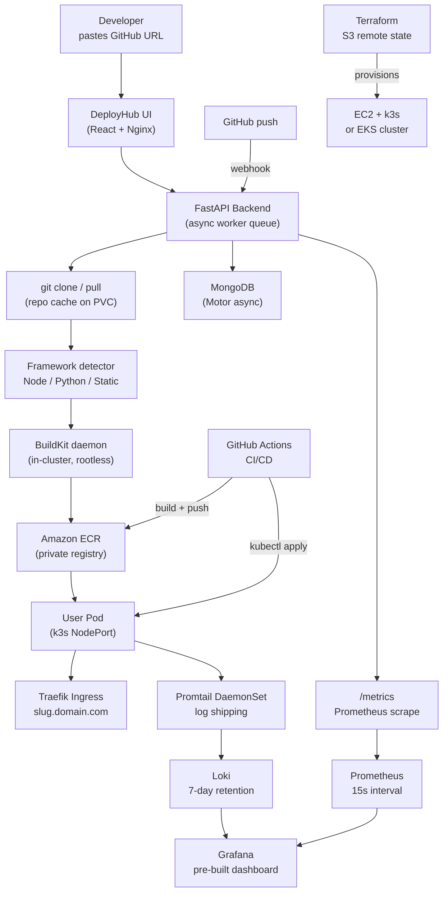

# DeployHub


**A self-hosted PaaS that takes a GitHub URL and produces a live HTTPS endpoint — zero config, zero Dockerfile required.**

Demo: [watch 3-min walkthrough](#) &nbsp;|&nbsp; Grafana: [screenshot](#)

---

## Architecture


```mermaid
flowchart TD
    Dev["Developer\npastes GitHub URL"] --> UI["DeployHub UI\n(React + Nginx)"]
    UI --> API["FastAPI Backend\n(async worker queue)"]
    API --> Git["git clone / pull\n(repo cache on PVC)"]
    Git --> Detect["Framework detector\nNode / Python / Static"]
    Detect --> BK["BuildKit daemon\n(in-cluster, rootless)"]
    BK --> ECR["Amazon ECR\n(private registry)"]
    ECR --> Pod["User Pod\n(k3s NodePort)"]
    Pod --> Ingress["Traefik Ingress\nslug.domain.com"]

    API --> Mongo["MongoDB\n(Motor async)"]
    API --> Metrics["/metrics\nPrometheus scrape"]
    Metrics --> Prom["Prometheus\n15s interval"]
    Prom --> Grafana["Grafana\npre-built dashboard"]
    Pod --> Promtail["Promtail DaemonSet\nlog shipping"]
    Promtail --> Loki["Loki\n7-day retention"]
    Loki --> Grafana

    GH["GitHub push"] -->|webhook| API
    GHA["GitHub Actions\nCI/CD"] -->|build + push| ECR
    GHA -->|kubectl apply| Pod
    TF["Terraform\nS3 remote state"] -->|provisions| EC2["EC2 + k3s\nor EKS cluster"]
```

---

## Key Engineering Decisions

- **BuildKit over Docker daemon** — BuildKit runs rootless inside the cluster, supports parallel layer builds, and its `--frontend dockerfile.v0` flag lets any repo's existing Dockerfile be used as-is without modification. The daemon approach would require privileged DinD containers.

- **Flat ECR repo layout** — user app images are pushed as `deployhub-apps:<project-id>` tags into a single pre-created ECR repository rather than creating one repo per project. This avoids the `ecr:CreateRepository` permission that AWS restricts on lab accounts, and keeps ECR lifecycle policies simple.

- **SSE over WebSocket for log streaming** — Server-Sent Events are unidirectional, HTTP/1.1 compatible, and automatically reconnect. The frontend falls back to 5-second polling if the SSE connection drops. WebSocket is used only for real-time status updates where bidirectional communication is needed.

- **Terraform remote state with per-account keys** — the S3 backend key includes the AWS account ID (`environments/k3s/<account-id>/terraform.tfstate`), so the same repo works across KodeKloud lab sessions without state collisions between different account IDs.

- **Wildcard SSL & HTTPS Enforcement** — automatically provisions AWS ACM wildcard certificates (`*.domain.com`) attached to the Application Load Balancer. The ALB enforces strict HTTP-to-HTTPS redirection, enabling end-to-end encryption and Cloudflare "Full (Strict)" proxying for all user apps without requiring per-project certificate generation.

---

## Metrics & Observability

All metrics are exposed at `GET /metrics` (Prometheus format) and scraped every 15 seconds.

| Metric | Type | Description |
|--------|------|-------------|
| `deployhub_projects_total` | Gauge | Total projects in MongoDB |
| `deployhub_deployments_total{action}` | Counter | Deploy / redeploy requests |
| `deployhub_deployment_success_total{action}` | Counter | Deployments that passed health check |
| `deployhub_deployment_failures_total{phase}` | Counter | Failed deployments by phase |
| `deployhub_deployment_duration_seconds{action}` | Histogram | End-to-end deployment time |
| `deployhub_active_containers` | Gauge | Running user pods |
| `deployhub_health_check_failures_total{reason}` | Counter | Post-deploy health check failures |
| `deployhub_pod_restarts_total{pod_name}` | Gauge | Container restart count per pod |
| `deployhub_pod_runtime_seconds{project_id}` | Counter | Cumulative pod uptime |
| `deployhub_build_duration_seconds{project_type}` | Histogram | BuildKit image build time |
| `http_requests_total{method,path,status_code}` | Counter | HTTP traffic by endpoint |
| `http_request_duration_seconds{method,path}` | Histogram | Request latency |

Grafana is pre-provisioned with a DeployHub dashboard (deployment rate, duration p50/p95, HTTP latency p95, pod restart table) and Loki log explorer. Alert rules fire on: backend down, high failure rate, health check failures, pod restart loops.

---

## CI/CD Pipeline

```
Pull Request → ci.yml
  ├── Ruff lint (backend)
  ├── pytest (12 tests — detector, API, security)
  ├── npm build (frontend)
  ├── Docker build (both images, layer-cached via GHA cache)
  ├── Trivy SARIF scan → GitHub Security tab
  └── terraform fmt + validate

Push to main → deploy.yml
  ├── Build images with OCI provenance labels
  │     org.opencontainers.image.revision = $GITHUB_SHA
  ├── Trivy SARIF scan (exit-code 1 on CRITICAL/HIGH)
  ├── Push to ECR (tagged sha-<7chars> + latest)
  ├── terraform apply (idempotent — provisions EC2 if missing)
  ├── envsubst → render k8s manifests with real secrets
  ├── kubectl apply + rollout status gate (300s timeout)
  ├── smoke_test.sh — 6 endpoint checks with retry
  └── GitHub Step Summary with all URLs
```

---

## Repository Structure

```
├── backend/
│   ├── main.py               FastAPI app, rate limiting, WebSocket, SSE
│   ├── worker.py             Async deployment queue, rollback, history
│   ├── database.py           Motor async MongoDB, compound indexes
│   ├── observability.py      12 Prometheus metrics + structured JSON logging
│   ├── security.py           HMAC-SHA256 webhook signature verification
│   └── utils/
│       ├── detector.py       Framework detection (Node/Python/static)
│       ├── buildkit.py       BuildKit async wrapper with ECR auth
│       ├── k8s.py            Kubernetes Python SDK wrappers
│       └── analyzer.py       Multi-service monorepo detection
├── frontend/                 React + Vite — 5 pages, radial nav, dark mode
├── k8s_deploy/               Kustomize manifests
│   ├── base/                 Shared control-plane resources + NetworkPolicies
│   └── overlays/
│       ├── k3s/              Traefik ingress + monitoring + logging
│       └── eks/              ALB ingress (no in-cluster monitoring)
├── terraform/
│   ├── modules/              networking / eks / ecs-monitoring / ecr / dns-acm
│   ├── environments/
│   │   ├── prod/             EKS + ECS + ALB — full production stack
│   │   └── k3s/              Single EC2 + k3s — quick demo / KodeKloud
│   └── bootstrap/            S3 + DynamoDB for remote state
├── .github/workflows/
│   ├── ci.yml                PR: lint + pytest + Trivy SARIF + terraform validate
│   └── deploy.yml            Push: build → scan → push → deploy → smoke test
└── scripts/
    ├── smoke_test.sh         6-endpoint post-deploy health check
    └── apply-secrets.sh      Local secrets rendering (no disk writes)
```

---

## Local Development

```bash
docker compose up --build
# UI: http://localhost:3000   API: http://localhost:8000
```

## Cloud Deployment

### k3s on EC2 (KodeKloud / quick demo)

```bash
cd terraform/environments/k3s && terraform init && terraform apply
./scripts/apply-secrets.sh
# Pipeline handles the rest on next push to main
```

### EKS (full production)

```bash
./scripts/deploy-eks.sh
# Provisions VPC → EKS → ECS monitoring → ALB → images → manifests
# Takes ~35 min on first run
```

---

## API Reference

| Method | Endpoint | Description |
|--------|----------|-------------|
| `POST` | `/api/projects` | Add a project (rate-limited: 10/min) |
| `GET` | `/api/projects` | List all projects |
| `GET` | `/api/projects/{id}` | Project detail + deployment history |
| `GET` | `/api/projects/{id}/history` | Last 50 deployments from MongoDB |
| `POST` | `/api/deploy/{id}` | Queue initial deploy |
| `POST` | `/api/redeploy/{id}` | Queue redeploy (auto-rollback on failure) |
| `POST` | `/api/stop/{id}` | Stop and remove pod |
| `DELETE` | `/api/projects/{id}` | Delete project + all resources |
| `GET` | `/api/logs/{id}/stream` | SSE live log stream |
| `GET` | `/api/projects/{id}/health` | Live pod health + restart count |
| `POST` | `/api/webhooks/github/{id}` | GitHub push webhook (per-project HMAC when configured) |
| `POST` | `/api/projects/{id}/webhook-secret` | Generate/rotate per-project webhook secret (shown once) |
| `POST` | `/api/projects/{id}/rollback` | Re-deploy last known-good image (skip build) |
| `GET` | `/api/projects/{id}/resources` | Namespace resource usage vs quota (k8s mode) |
| `GET` | `/api/system` | Cluster status incl. `queue_depth`, `max_concurrent_builds` |
| `GET` | `/api/stats` | Persistent deployment stats from MongoDB |
| `GET` | `/metrics` | Prometheus scrape endpoint |
| `WS` | `/ws/projects/{id}` | WebSocket real-time status updates |

---

## Configuring your app

Add an optional `deployhub.yml` at the **repository root** to override autodetection.
Do **not** put secrets in this file — use the DeployHub UI env-var field or your
platform secret store instead.

```yaml
# deployhub.yml — runtime overrides only (no secrets)
port: 3000
healthPath: /health
buildContext: ./app
env:
  NODE_ENV: production
  LOG_LEVEL: info
```

| Key | Effect |
|-----|--------|
| `port` | Container port exposed to health checks and the Service |
| `healthPath` | HTTP path used for post-deploy health probing (default `/`) |
| `buildContext` | Subdirectory used as the Docker build context (monorepos) |
| `env` | Non-secret env vars injected into the runtime Deployment/Pod |

---

## What I Learned

- **Kubernetes pod scheduling is not instantaneous** — the health check needs to wait for `Running` phase AND container readiness before HTTP-probing. Skipping the pod readiness wait caused false rollbacks on slow image pulls. The fix was a two-stage check: `wait_for_pod_running()` then exponential-backoff HTTP probing.

- **BuildKit's `--frontend` flag** lets you use any Dockerfile parser, which is how repos with their own Dockerfile are supported without modification. The generated Dockerfile path is passed via `--local dockerfile=<dir>` and `--opt filename=<name>`, keeping the build context separate from the Dockerfile location.

- **Prometheus counters reset on pod restart** — deployment stats showed 0 after every backend redeploy. The fix was a `/api/stats` endpoint that aggregates from MongoDB's `deployment_history` array, which persists across restarts. Prometheus is now used only for rate/latency metrics where recency matters more than history.

---

## Resume Bullet

*Built DeployHub, a self-hosted Kubernetes PaaS on AWS (k3s + EC2) that automatically detects, builds, and deploys any public GitHub repository — Node, Python, or static — with zero configuration. Implemented an async deployment queue in FastAPI with BuildKit for in-cluster image builds pushed to ECR, post-deployment health checks with exponential backoff and automatic rollback, SSE log streaming, and a full observability stack (Prometheus, Grafana, Loki, Promtail) with 12 custom metrics and pre-provisioned dashboards. Infrastructure is fully Terraform-managed (including dynamic AWS ACM wildcard certificates and ALB strict HTTPS redirection) with remote state on S3; CI/CD via GitHub Actions runs pytest, Trivy SARIF scans (results visible in GitHub Security tab), and deploys on every push to main with a smoke test gate.*
